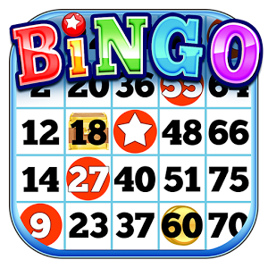
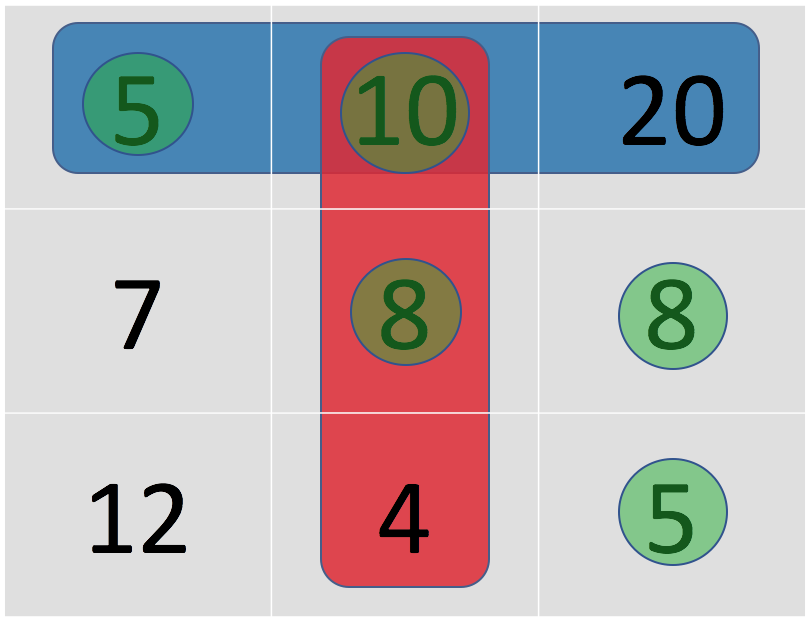

### What is traditional Bingo?
In the United States, Bingo is a game of chance in which each player matches numbers pre-printed in different arrangements on 5×5 cards with the numbers the game host draws at random, marking the selected numbers with tiles. When a player finds the selected numbers are arranged on their card in a row, they call out "Bingo!" to alert all participants to a winning card, which prompts the game host (or an associate assisting the host) to examine the card for verification of the win. Players compete against one another to be the first to have a winning arrangement for the prize or jackpot. After a winner is declared, the players clear their number cards of the tiles and the game host begins a new round of play. (Source - [Wikipedia](https://en.wikipedia.org/wiki/Bingo_(U.S.)))

### Lets define custom Bingo :smiley:
Here we are going to define bingo in a bit different way. We will play bingo as follows:
- Every player who is playing bingo comes up with a **3 x 3 matrix** of his own choice ranging from numbers **1 to 20** (both inclusive). You may use the same integer **more than once**.
- We will mark one square on your bingo board if you have **at least one unmarked square** that is a multiple of the total rolled (if more than one unmarked square is a multiple of the total, we will pick one at random).
- We will take turns until at least one board has bingo (3 marks in a row, horizontal, vertical, or diagonal).
- Each player whose board has bingo gets a share of the win (if n players get bingo, then each gets 1/n wins).
- We will simulate 10,000 games (you can select some other number of your choice) using all the bingo boards submitted. The goal is to get the **most wins out of all contestants**.

### Example
Now that you have understood the rules of the game let's look at an example :bulb:

- Consider rolling the 2 dices 5 times and outcomes after adding both of them are 5,10,4,5 and 8 respectively.
- Note that the 5 times are same as 5 turns and each turn is the sum of the numbers appearing on each dice.
- At the first turn the sum of the dices is 5 so the algorithm will select a 5 or a multiple of 5 which in this case is 5,10 and 20. Lets say that the algorithm choose to select the lower-rightmost 5 in the image shown in green color.
- We take the next turn and the sum of the dices in 10. The possible choices for the algorithm here are 10 and 20, let's say the algorithm select's 10 as shown in green color.
- For the third turn we have 4. The possible choices are 4, 8 and 12, let's say the algorithm select's 8 located at the center of the matrix.
- For the fourth turn we have 5 again. Now the multiples that are avialable to be marked are 5 located at the left-uppermost corner and 20.  
- :warning: Not that 5 located at lower-rightmost position and 10 is no longer available to be marked. This time the algorithm chooses the reamaining number 5 located at left-uppermost corner.
- For the last turn we have 8. The only multiple of 8 in the matrix shown is 8 and there is only one 8 available which the algorithm can select one located at the middle of the last column.
- All the elements selected (hypothetically) by the algorithm are shown in green circles. The blue row and the red column show the possible ways it would have been a bingo had the algorithm selected appropriate numbers but as mentioned in the rules in the intial section the algorithm can choose random number if there are more than one multiples unmarked (and this makes the problem or the game a great challenge of probability and statistics).

### Simulating the game
- You will find two folders in the bingo repository namely [images](images) and [notebooks](notebooks). The images folder has images which are intermediately used in the explanation in one of the ipython notebooks. The notebooks folder contains two ipython notebooks namely [bingo.ipynb](notebooks/bingo.ipynb), [play_bingo.ipynb](notebooks/play_bingo.ipynb) and a [bingo.py](notebooks/bingo.py) python script.
- You shall notice that we are using the [bingo.py](notebooks/bingo.py) file as module in [play_bingo.ipynb](notebooks/play_bingo.ipynb). The [bingo.py](notebooks/bingo.py) is a simple python script as opposed to the [bingo.ipynb](notebooks/bingo.ipynb) which is a jupyter notebook. We converted the file to simple python script so that we could use it as a module in the [play_bingo.ipynb](notebooks/play_bingo.ipynb) file.
- [bingo.ipynb](notebooks/bingo.ipynb) conatins all the neccessary helper functions needed to simulate the game. I highly encourage you to look at the source code to have an better understanding of how the game is coded.
- [play_bingo.ipynb](notebooks/play_bingo.ipynb) is the file which can directly simulate the game without knowing anything about the helper functions in the [bingo.ipynb](notebooks/bingo.ipynb) file. Please follow the instruction and read the description in the begining of the [play_bingo.ipynb](notebooks/play_bingo.ipynb) file to follow along.

    													
													
																								
													
													
